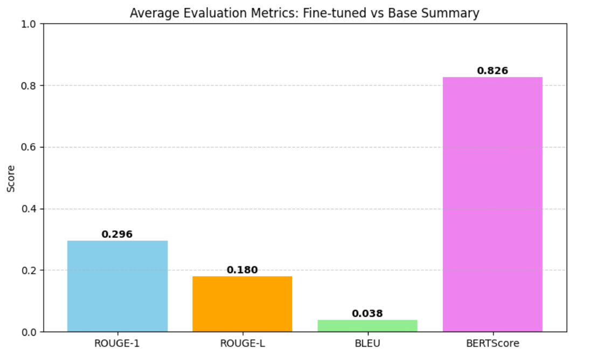
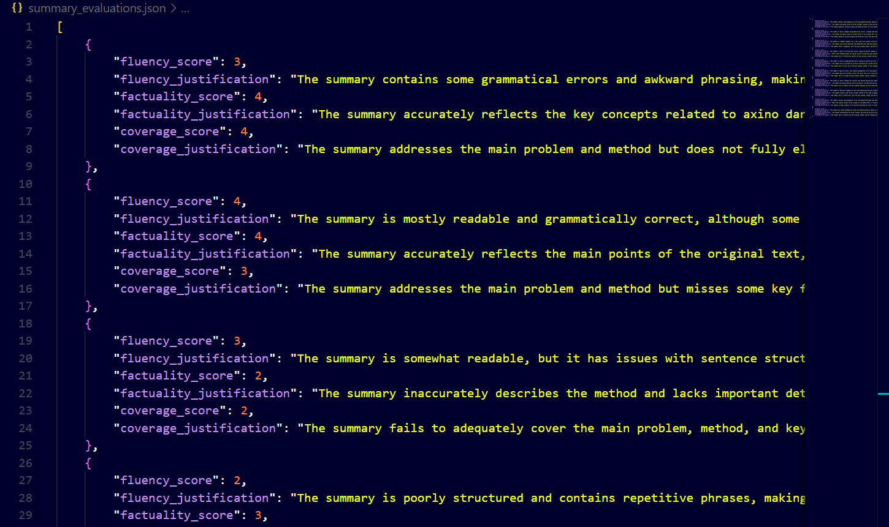
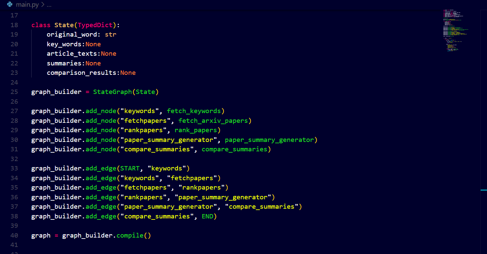

# Smart Summarizer – Multi-Agent Autonomous Research Assistant

This project is focusing on **fine-tuning LLMs for summarization** and building a fully autonomous **multi-agent research assistant**.

---

## Project Overview

### Phase 1: Fine-Tuning LLM for Summarization

- Fine-tuned a large language model Llama-3.2-3B on scientific paper summarization tasks.
- Evaluated performance using:
  - **Traditional Metrics**: ROUGE, BLEU, BERTScore
  - **LLM-as-a-Judge**: Fluency, Factuality, Coverage

---

### 🤖 Phase 2: Multi-Agent Research Assistant

Built using **LangGraph** and **GPT-4o-mini (via OpenAI API)**.  
The assistant consists of 5 autonomous agents working together to conduct research efficiently.

#### 🧩 Agents Description

1. **Keyword Agent**  
   Expands the user’s input query into meaningful and broad search terms.

2. **Search Agent**  
   Conducts literature search using academic APIs and retrieves paper metadata.

3. **Rank Agent**  
   Ranks and filters papers using custom heuristics and LLM-based scoring.

4. **Summary Agent**  
   Extracts key sections (abstract, methods, etc.) and generates summaries using the fine-tuned model.

5. **Compare Agent**  
   Performs comparative analysis of selected papers and extracts insightful differences or patterns.

---

## 🛠️ Tech Stack

- **LangGraph** for multi-agent orchestration  
- **OpenAI GPT-4o-mini** for prompting and evaluation  
- **Python** (Pytorch , transformers , evaluate , matplotlib , etc.)  
- **Hugging Face Transformers** for fine-tuning  
- **Academic APIs** for paper search
